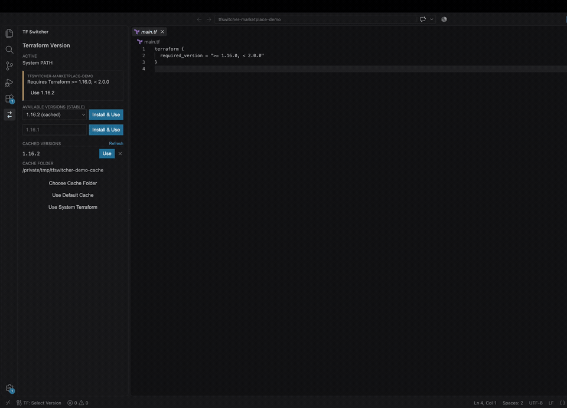

# TF Switcher

TF Switcher is a Visual Studio Code extension for installing and switching
workspace-specific Terraform versions without a command-line version manager.
It is designed for managed enterprise devices, teams working across projects,
and users who prefer a visual workflow.

[Install TF Switcher from the Visual Studio Marketplace](https://marketplace.visualstudio.com/items?itemName=345Dave.tfswitcher)

## Current release

### 1.16.5 — 17 September 2026

- Added an optional Ko-fi Sponsor link to the Marketplace and VS Code extension
  details.
- Added support information and an opt-in public supporters page.
- All extension features remain free to use.

## Previous release

### 1.16.4 — 16 September 2026

- Added offline import for an approved Terraform ZIP and its matching HashiCorp
  checksum file—useful when direct downloads are blocked by enterprise policy.
- Hardened ZIP processing with platform, filename, archive-layout, size,
  checksum, and executable-version checks before Terraform enters the cache.
- Added automated secret scanning, dependency auditing, VSIX inspection, and
  package checksum generation for releases.
- Added a Windows CI road test that imports and runs a genuine
  `terraform.exe`, alongside macOS and Linux validation.

The Visual Studio Marketplace is the official installation and update source
for TF Switcher.

## See it in action

TF Switcher reads the workspace requirement, offers a compatible Terraform
version, activates it for new VS Code terminals, and verifies the result.

## Highlights

- Installs official Terraform releases directly from HashiCorp.
- Does not require access to GitHub when using the extension.
- Detects `required_version` constraints in Terraform workspaces.
- Verifies every downloaded ZIP against HashiCorp's SHA-256 checksum.
- Imports approved Terraform ZIPs and matching checksums for offline or
  restricted-network installation.
- Changes `PATH` only for new or relaunched VS Code terminals.
- Reuses previously downloaded versions from a local cache.
- Does not collect telemetry or request Terraform credentials.

## Supported platforms

| Platform | Architectures |
| --- | --- |
| Windows | x64, ARM64, x86 |
| macOS | Apple Silicon, Intel |
| Linux | x64, ARM64, x86 |

## Network requirements

Installing a Terraform version requires HTTPS access to
`releases.hashicorp.com`. Loading the available-version list requires access to
`api.releases.hashicorp.com`. Previously cached Terraform versions remain
available offline. If those endpoints are unavailable, use **Import Terraform
ZIP** with an official Terraform archive and its matching HashiCorp checksum
file supplied by your IT team or another trusted source.

## Support TF Switcher

TF Switcher is free to use, with all features available without contributing.
If it saves you time, [support its development on Ko-fi](https://ko-fi.com/345dave).
Optional contributions help fund maintenance, testing, and improvements.

Supporters can choose to be thanked on the [supporters page](SUPPORTERS.md).
See that page for how to opt in; recognition is entirely optional.

## Support and feedback

- [Troubleshooting guide](TROUBLESHOOTING.md)
- [Security and verification](SECURITY-VERIFICATION.md)
- [Report a bug](https://github.com/345dave/tfswitcher-docs/issues/new?template=bug_report.yml)
- [Request a feature](https://github.com/345dave/tfswitcher-docs/issues/new?template=feature_request.yml)
- [Security policy](SECURITY.md)

Do not include Terraform credentials, access tokens, internal configuration, or
other secrets in reports.

This repository contains public documentation and media for TF Switcher. The
extension's implementation repository is maintained separately.
